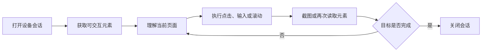
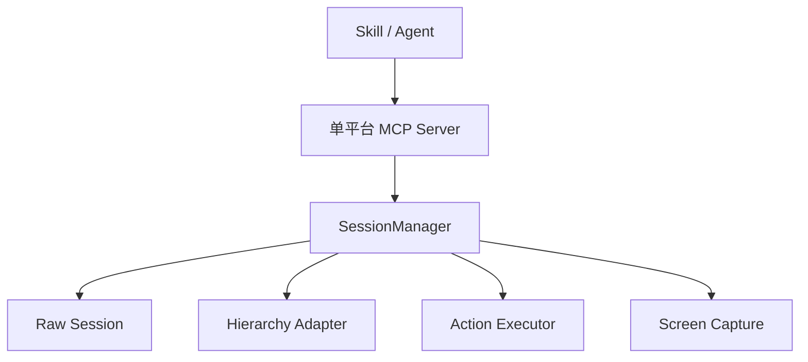
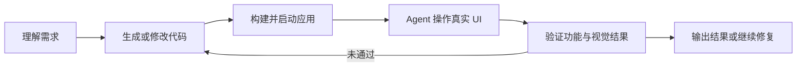

# 让 AI Agent 走出浏览器：我们如何统一操控 Android、iOS、WebView 与 Unity

在建设全自动化的 AI Native 需求产出流程时，我们遇到了一个很现实的问题：

**现有 Skill 类 Agent 操作 Web 页面比较成熟，但一旦需求涉及 Android、iOS 或 Unity 应用，自动化链路就会断掉。**

这意味着，Agent 可以分析需求、编写代码、启动服务，也可以在浏览器里验证结果，却无法独立完成移动端和游戏应用中的点击、输入、滚动、截图与结果检查。流程最后仍然需要人接管设备，AI Native 也就停留在“局部自动化”，而不是端到端闭环。

为了解决这个问题，我们实现了一组面向 Agent 的跨技术栈 UI 操作 MCP：

- Android Native MCP
- Android WebView MCP
- iOS Native MCP
- iOS WebView MCP
- iOS Browser MCP
- Unity Poco MCP

它们底层分别连接 ADB、Chrome DevTools Protocol、Appium/XCUITest 和 Poco，但向 Agent 提供一致的观察与操作方式。本文分享我们为什么这样设计，以及实现过程中最关键的取舍。

## 问题不只是“让 AI 点一下屏幕”

浏览器 Agent 之所以发展得较快，一个重要原因是 Web 天然具有相对统一的交互基础：

- DOM 提供结构化页面信息；
- 元素通常具有文本、属性和选择器；
- JavaScript 可以直接执行交互；
- CDP 等协议提供了成熟的调试和自动化能力。

但 App 世界没有统一的 DOM。

Android 原生页面暴露的是 UIAutomator 层级，iOS 原生页面依赖 XCUITest 的可访问性树，WebView 需要切换到 Web 上下文，不过这套能力与浏览器类似，Unity 游戏内 UI 又存在于引擎自己的节点树中。即使都是一个“点击”动作，底层实现也可能分别是：

- 执行一次 ADB tap；
- 查找一个 DOM 节点并触发 click；
- 通过 Appium 操作 XCUITest 元素；
- 根据 Poco 节点坐标点击游戏画面。

因此，我们真正要解决的并不是设备控制，而是三个更上层的问题：

1. 如何让 Agent 看懂不同技术栈的页面；
2. 如何让 Agent 用一套稳定的语义执行操作；
3. 如何管理设备连接、页面变化、截图和错误，让 Agent 能连续完成任务。

## 核心思路：统一 Agent 协议，不强行统一平台实现

我们没有构造一个包含所有依赖和平台逻辑的“万能服务”，而是把每种运行环境做成独立 MCP Server。

每个 Server 只负责一个明确的平台场景，但对外提供相同的工具：

```text
get_platform_info
open_session
close_session
list_sessions
get_interactive_elements
execute_action
take_screenshot
```

其中，Agent 最主要的工作循环是：



动作层同样采用统一语义，包括：

```text
click
input_text
scroll
drag
wait
press_key
long_click
click_position
kill_app
```

这样，Skill类各agent不需要知道一次点击最终由 ADB、Appium、CDP 还是 Poco 完成。它只需要知道当前有哪些可操作元素，以及希望对哪个元素执行什么动作。

我们统一的是 Agent 的认知和操作接口，而不是抹平底层平台的真实差异。

## 架构：Session、Hierarchy、Executor 与 Capture

每个平台内部都被拆成四个主要部分：



### SessionManager

`SessionManager` 是公共控制层，负责：

- 创建和关闭会话；
- 保存平台连接及配置摘要；
- 串行化同一会话中的操作；
- 分发统一动作；
- 将底层结果和异常转换为结构化响应；
- 管理截图路径及会话状态。

会话是必要的，因为移动端自动化不是一次性的函数调用。设备连接、Appium Driver、WebView 调试通道和 Poco 连接都需要跨越多个 Agent 步骤持续存在。

同时，每个会话拥有独立锁，避免同一设备上的“读取页面”和“点击元素”并发执行，引发状态错乱。

### Hierarchy Adapter

Hierarchy Adapter 负责把各平台完全不同的页面结构，转换成 Agent 易于消费的交互元素列表。例如：

```text
[0] Button "登录" pos=(312, 688) size=(120x48) [clickable]
[1] TextField "请输入手机号" pos=(196, 520) size=(320x44)
[2] ScrollView pos=(195, 410) size=(390x620) [scrollable]
```

每个元素还会进入当前页面的 `selector map`，Agent 可以直接使用较短的 index 发起操作，而不必把冗长、易错的平台选择器传来传去。

这一步也能显著压缩上下文。相比把完整 XML、DOM 或 Unity 节点树交给模型，只返回当前可见、可能交互的元素，信息密度更高，Token 消耗也更可控。

### Action Executor

Executor 接收统一动作，再转换为平台调用。

例如 `click(index=0)`：

- Android Native：从 UIAutomator 结果中取元素中心点，通过 ADB tap 点击；
- Android WebView：定位注入了临时 index 的 DOM 元素，执行 JavaScript click；
- iOS Native：在 XCUITest 上下文中完成元素或坐标操作；
- Unity：根据 Poco 节点位置或节点代理完成点击。

Executor 也保留平台能力差异。某个平台不可靠或不支持某项动作时，会返回明确的失败结果，而不是伪装成完全一致。

### Screen Capture

结构化元素告诉 Agent“页面上有什么”，截图则帮助 Agent确认“页面实际看起来怎样”。

Android 使用 ADB screencap，iOS 通过 Appium 获取截图，Unity 使用 Poco snapshot。截图既可以作为视觉模型的输入，也可以作为自动化流程的执行证据。

## 不同技术栈如何接入

### Android Native：UIAutomator + ADB

Android 原生实现通过 `uiautomator dump` 获取当前页面 XML，遍历节点并提取：

- text 与 content description；
- resource id 与控件类型；
- clickable、focusable、scrollable 等状态；
- bounds、中心坐标和尺寸。

操作层则使用 ADB 的 input 能力完成点击、文本输入、滑动、按键和长按。

这条链路依赖少、部署简单，适合作为 Android 原生应用的基础能力。它的限制也很明确：如果应用没有暴露足够的可访问性信息，Agent 能看到的语义就会减少，此时需要结合截图和坐标操作兜底。

### Android WebView：ADB DevTools Socket + CDP

WebView 虽然运行在 Android App 内部，但其内容仍然是 DOM。我们通过 ADB 查找设备上的 DevTools socket，将它转发到本地端口，再通过 CDP 连接目标页面。

连接成功后，在页面中执行一段元素提取脚本：

- 筛选链接、按钮、输入框、可编辑元素以及具有交互样式的节点；
- 排除隐藏、尺寸过小和视口外元素；
- 提取文本、类型、位置和尺寸；
- 为当前轮次元素注入临时 `data-agent-idx`。

后续点击和输入便可以通过这个 index 精确定位 DOM 节点。

这里的关键不是简单复用浏览器自动化，而是打通“设备内 WebView 调试通道”，使 Agent 不需要把混合应用误当成一张只能坐标点击的图片。

### iOS Native：Appium + XCUITest

iOS 原生应用通过 Appium 创建 XCUITest Session，读取页面 source 后解析可访问性节点。

实现中需要特别处理两个坐标空间：

- Appium 返回的逻辑屏幕尺寸；
- 实际截图的像素尺寸。

在 Retina 设备上两者可能不一致。如果后续需要将视觉模型输出的截图坐标映射到设备操作坐标，就必须进行缩放换算，否则“看起来点在按钮上”的坐标可能落到错误位置。

### iOS WebView 与 Safari：上下文切换

iOS 混合应用和 Safari 的核心问题是 Context。

原生控件存在于 `NATIVE_APP`，网页内容存在于 `WEBVIEW`。实现中会枚举可用 Context，优先切换到指定或首个可用的 WebView，再用 JavaScript 提取页面元素。

对于 Safari 场景，我们还保留原生树回退。当 WebView Context 暂时不可用时，Agent 至少还能操作地址栏、系统弹窗等原生浏览器界面，而不是直接失去整个页面的控制能力。

### Unity：Poco 节点树

Unity 应用无法依赖 Android 或 iOS 的原生 UI 树来完整描述游戏内界面，因此我们通过 Poco SDK 读取 Unity 节点层级。

适配层会提取节点的：

- name、type 与 text；
- 归一化坐标与尺寸；
- clickable 等交互属性。

随后通过 Poco 完成 click、set_text、swipe、long_click 和 snapshot。该实现既可以连接 Unity Editor，也可以通过 Airtest 连接 Android、iOS 或桌面运行环境。

这说明“跨平台”并不等于只适配操作系统。对于 Flutter、React Native、Unity 等技术栈，Agent 最终需要连接的是能够提供最佳语义信息的那一层。

## 跨技术栈应用如何选择 MCP

当一个应用同时包含 Native、WebView 和 Unity 等多种技术栈时，还有一个关键问题：**Agent 如何判断当前步骤应该使用哪个 MCP？**

### 第一版：根据运行时信号判断

一开始，我们尝试结合主要业务场景，通过运行时信号进行判断：

- Android 检测到 `webview_devtools_remote` socket，说明页面可能包含 WebView；
- iOS Appium Context 中出现 `WEBVIEW_*`，说明应用存在 WebView Context；
- Poco SDK 端口连接成功，说明可以使用 Unity Poco。

这些信号能够说明某种自动化能力当前可用，但后续在更多业务场景中，我们发现了很多反例：

- 应用中存在 WebView 调试通道，但当前需要操作的是原生弹窗；
- iOS 存在 `WEBVIEW_*` Context，但目标控件位于原生导航栏；
- Unity 应用嵌入了 WebView，WebView 和 Poco 两条通道可能同时可用；
- Poco 端口连接正常，但用户当前要操作的控件实际属于 WebView；
- 后台仍保留上一页面的 WebView Context，而前台已经切换到其他技术栈。

因此，**检测到某种运行时，只能证明它存在，不能证明当前操作应该由它完成。**

### 第二版：把各技术栈的页面元素交给模型判断

后续我们增加了 `app-runtime-router-mcp`。它会同时尝试从当前可用的技术栈中获取页面元素，例如：

```text
Android Native -> UIAutomator 元素
Android WebView -> DOM 元素
iOS Native -> XCUITest 元素
iOS WebView / Safari -> DOM 元素
Unity Poco -> Unity 节点元素
```

Router 会将每个技术栈能够看到的元素列表、可用状态和采集错误统一返回。同时，它还会接收用户当前步骤的操作描述，例如：

```text
点击“开始游戏”按钮
```

假设此时 WebView 和 Poco 都可以连接，但它们看到的元素不同：

```json
{
  "user_intent": "点击开始游戏按钮",
  "candidates": [
    {
      "runtime": "android_webview",
      "mcp": "android-webview-mcp",
      "elements_text": "[0] link text=\"用户协议\""
    },
    {
      "runtime": "unity_poco",
      "mcp": "unity-poco-mcp",
      "elements_text": "[0] Button text=\"开始游戏\""
    }
  ]
}
```

大模型可以结合用户的操作描述与各技术栈实际获取到的页面元素，判断 `unity-poco-mcp` 更适合完成当前步骤。

因此，最终的路由逻辑不再是：

```text
检测到 WebView -> 使用 WebView MCP
```

而是：

```text
获取用户操作描述
    -> 并行获取各技术栈的页面元素
    -> 比较哪个技术栈能够看到目标控件
    -> 由大模型选择对应 MCP
```

这种方式没有试图用更多硬编码规则覆盖所有业务场景，而是把运行时信息、页面元素和用户意图共同作为上下文，让模型完成更符合当前页面状态的决策。

路由结果也不是永久有效的。一次点击可能让页面从 Native 跳转到 WebView，也可能从 WebView 返回 Unity 场景。因此，在页面跳转或 UI 发生明显变化后，需要重新获取各技术栈的页面元素，再决定下一步使用哪个 MCP。

## 为什么用 index，而不是让 Agent 自己生成选择器

我们在每次读取页面后，都会建立一份当前页面的 index 到元素信息映射。这样做有三个原因：

第一，减少模型负担。Agent 只需表达“点击第 3 个元素”，不需要拼接 XPath、CSS Selector 或 Poco 查询条件。

第二，统一不同平台。XPath、CSS Selector、resource id 和 Poco 节点查询没有共同格式，但 index 可以成为一次观察结果内的公共引用。

第三，控制选择器有效期。页面变化后，旧 index 可能失效，因此我们明确要求在关键动作前重新读取元素。这比让 Agent 长期持有一个看似稳定、实际已经过期的选择器更容易推理和排障。

index 并不是元素的永久身份，而是 Agent 对当前页面快照的短期引用。

## 为什么拆成六个 MCP Server

早期很容易想到把所有能力放进同一个 Server，再通过 `platform` 参数切换。但实践中，单平台拆分更合适：

- ADB、Appium、WebSocket、Poco 的依赖彼此独立；
- 不同平台的启动前置条件不同；
- Agent 可以只挂载当前任务需要的工具；
- 工具说明更聚焦，降低模型选错平台的概率；
- 单个平台故障不会扩大到整个服务；
- 测试、版本管理和开源边界更清晰。

多个 MCP Server 并不会增加上层 Skill 的复杂度，因为它们遵循相同的生命周期和动作协议。相反，这种设计把平台复杂性留在适配器内部，把组合权交给 MCP Client。

## 实现中踩过的几个关键问题

### 页面元素不是稳定资产

App 页面会因为动画、弹窗、网络加载和列表刷新迅速变化。读取元素后等待太久再点击，很容易发生 index 漂移。

我们的原则是：**观察和动作尽量靠近，页面发生明显变化后立即重新观察。**

### stdout 对 stdio MCP 很敏感

stdio MCP 使用标准输出传输协议消息，而一些底层 SDK 会直接打印日志。一旦普通日志混入 stdout，就可能破坏协议。

因此，调用底层适配器时需要保护 stdio 通道，将非协议输出重定向到 stderr，并串行处理相关调用。

### 结构化树和截图缺一不可

只依赖截图，Agent 很难稳定定位文本框、不可见状态和小尺寸控件；只依赖结构化树，又无法识别画布内容、遮挡关系和视觉结果。

更可靠的方案是：

- 用结构化元素完成主要定位和操作；
- 用截图理解视觉状态和验证结果；
- 在语义信息不足时使用坐标操作兜底。

### “动作调用成功”不等于“任务成功”

底层返回 click 成功，只能说明命令被执行，不能证明页面进入了预期状态。

因此每个关键动作之后，Agent 都应再次获取元素或截图，验证目标状态是否出现。真正的闭环是“观察、行动、再观察”，而不是连续发送操作命令。

## 在 AI Native 研发流程中的位置

这套能力并不是为了替代 Appium、ADB 或 Poco。它们本身已经是成熟的自动化基础设施。

我们所做的是在这些能力之上增加一层 Agent-friendly interface，让 Skill 可以把移动端和 Unity 应用纳入同一条需求产出链路：



当 Agent 能够操作最终产物，自动化流程才从“代码生成”向“需求交付”迈进一步。

目前这套方案更准确的定位是：为不同客户端技术栈提供统一、可组合、可被 Skill 调用的 UI 执行基础设施。上层仍然需要任务规划、异常恢复、账号与测试数据准备，以及针对具体业务的验收规则。


## 结语

面对 Android、iOS、WebView 和 Unity 这样的跨技术栈场景，还有另一条更彻底的“大一统”路线：纯视觉自动化。

以 Midscene 等方案为例，Agent 可以直接根据截图理解页面，并通过坐标完成点击、输入和滑动。它不需要关心页面来自 Native、WebView 还是 Unity，也不依赖控件是否暴露了完整的 DOM、可访问性树或 Poco 节点。对于技术栈复杂、语义树缺失或者页面实现频繁变化的应用，这种方案具有非常明显的优势。

但纯视觉也有自己的代价。

视觉操作通常依赖当前截图中的布局和坐标。同一个任务换到不同分辨率、屏幕比例或系统字体的设备后，原有操作轨迹不一定能够直接复用。它更适合让模型根据每一帧画面重新理解和决策，但较难像结构化元素方案一样形成稳定的选择器、录制回放和跨设备执行能力。

同时，截图会因为时间、电量、网络状态、动态内容和细微渲染差异不断变化。相较于文本化、结构化的元素信息，视觉输入的缓存命中率通常更低，推理成本和执行延迟也更高。

因此，我们并不认为纯视觉和结构化元素是非此即彼的两条路线：

- 纯视觉负责跨越技术栈边界，处理画布、弱可访问性页面和结构化信息缺失的场景；
- Native、DOM、XCUITest 和 Poco 元素负责提供稳定语义，支持定位复用、录制回放和更低成本的重复执行；
- 当多个结构化技术栈同时存在时，由 Router 结合用户意图和页面元素选择执行器；
- 当结构化元素无法描述目标时，再使用视觉理解和坐标操作兜底。

更理想的 Agent UI 自动化能力，应该同时拥有“看懂屏幕”和“理解控件”两种视角：既能像人一样面对任何界面，也能在条件允许时利用结构化信息获得更高的稳定性、可复用性和执行效率。

这也是这套实现最终希望补上的能力：**让 Agent 不仅能够跨技术栈操作应用，还能在视觉通用性与结构化工程能力之间做出合适的选择。**
