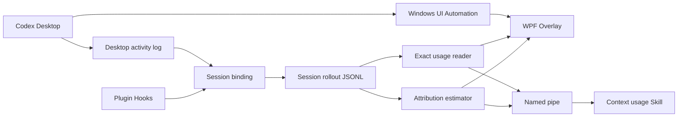

> **分享稿草案，尚未发布。** 本文记录一个 Windows 本地实验项目：在 Codex Desktop 输入框附近持续显示当前 Context 使用情况，并进一步拆解 Skill、MCP server/tool、消息和工具结果的大致占用。文中的本地接口、数值和实现细节仍需在发布前复核。

## 为什么想做这件事

短任务里，我们通常不会在意 Context。提需求、改代码、跑测试，一轮工作很快结束。

但当一个 Codex task 持续几小时甚至几天，Context 就不再只是底层模型概念，而会变成一种需要管理的工作资源。系统指令、项目规则、对话历史、工具调用、Skill 指令、MCP tool schema，以及历史压缩生成的摘要，都在共享同一个有限窗口。

这时我经常想知道：

- 当前 task 到底用了多少 Context？
- 距离窗口上限还有多远？
- 最近安装的 Skill 或启用的 MCP server，大约增加了多少负担？
- 是哪一类工具结果正在快速挤占空间？
- 现在应该继续工作、主动 compact，还是另开一个 task？

只看到一个百分比并不够。它像汽车仪表盘上的剩余油量，能告诉你还剩多少，却解释不了油耗来自哪里。

于是，最初“在输入框旁边放一个 Context 按钮”的小想法，逐渐变成了一个 Context 可观测性工具。

## 最终做出来的东西

这个实验项目叫 `Codex Context Inspector`。它在 Windows 版 Codex Desktop 的输入框下方显示一个紧凑状态：

```text
Context 37.3%
```

悬停或点击后，可以继续查看当前输入 Context、模型窗口大小、剩余空间、缓存输入，以及系统指令、Skill、MCP 工具、消息和工具结果的本地估算。Skill 可以逐个展开，MCP 工具也可以按 server 和 tool 展开。

```text
Context usage                         37.3%
Current input                         96.3k
Model window                         258.4k
Remaining                            162.1k
Cached input                          94.0k

Estimated breakdown
System & policies                  ≈   7.0k
Skills                             ≈   4.5k
MCP / plugin tools                ≈   7.5k
User messages                     ≈   1.4k
Assistant messages                ≈   0.9k
Other tool results                ≈  52.6k
Compaction summary                ≈   3.6k
Unattributed / hidden             ≈   2.0k
```

整个工具在本机运行，不把会话内容上传到外部服务。

## 第一条原则：不要给估算披上准确值的外衣

这个项目最重要的设计决定，不是展示尽可能多的数字，而是先说明每个数字的证据等级。

| 类型 | 含义 | 示例 |
| --- | --- | --- |
| Exact | 直接来自 Codex 本地 token 记录 | 当前输入、缓存输入、模型窗口 |
| Derived | 由准确字段确定性计算 | 剩余空间、使用百分比 |
| Estimated | 根据本地可见记录估算 | Skill、MCP tool、消息和工具结果 |
| Unavailable | 当前没有足够证据 | 无法识别的数据结构 |

准确总量的计算很简单：

```text
used       = last_token_usage.input_tokens
window     = model_context_window
remaining  = max(0, window - used)
percent    = used / window × 100%
```

一个很容易踩的坑是把 `total_token_usage` 当成当前 Context。它表示整个 session 的累计消耗，可能远大于模型窗口；真正对应当前请求携带 Context 的，是最新的 `last_token_usage.input_tokens`。

至于 Skill 和 MCP tool 的逐项占用，Codex 并没有直接提供精确账单。因此面板统一用 `≈` 标识，并采用一个透明的近似：

```text
estimated_tokens ≈ ceil(UTF-8 bytes / 4)
```

这不是模型 tokenizer，只适合观察相对量级。它的意义是帮助判断“哪里可能偏大”，而不是声称某个 Skill 精确占用了多少 token。

## 为什么是插件加 Windows Overlay

插件适合打包 Skill、Hooks、sidecar 和安装信息，但这个实验没有通过受支持的扩展点把按钮直接注入 Codex Desktop 的 composer。

为了不修改 Codex 安装文件、不注入 DLL，也不依赖 Chromium 内部 DOM，我选择了一个独立的 .NET 8 WPF sidecar：

- 使用 Windows UI Automation 定位 Codex 窗口和输入框；
- 用一个不抢焦点的透明 Overlay 跟随输入框移动；
- 从本机会话记录读取 Context 数据；
- 通过当前用户专用的命名管道，让 Skill 和 Overlay 共用同一份报告。



这个方案把插件能力和桌面 UI 解耦，侵入性较低，但也带来明确代价：UI Automation、Desktop activity log 和 rollout JSONL 都属于兼容面，宿主更新后可能需要适配。

## 真正最难的不是读 token，而是证明它属于当前 task

原型最早在开发对话里工作正常，但切换到其他 task 后，Context 一直显示为 0 或空。

当时表面上所有东西都没问题：插件已经安装，Hooks 已启用，也完成了信任确认。真正有价值的证据来自诊断日志：能显示数据的 task 曾经被手动执行 `--hook` 完成绑定，而新 task 只有 `ui.unbound`，没有新的 `hook.received`。

也就是说，Overlay 没坏，token reader 也没坏；缺失的是“当前 UI task 对应哪个 session”的可靠绑定。

这次排查让我形成了一个很实用的顺序：

1. 先确认 Overlay 是否定位到了正确窗口；
2. 再确认当前 task 是否绑定到了 session；
3. 再确认对应 rollout 是否存在 token snapshot；
4. 最后才检查数值计算。

如果一开始只盯着“为什么是 0”，很容易在公式和 JSON parser 上浪费时间。

## 为什么不能直接选择“最近修改的 JSONL”

最省事的做法，是扫描 session 文件，然后选择最近更新的 JSONL。但这在多个 task 并行运行时非常危险。另一个后台 task 仍可能持续写入 token event，此时“最近修改”并不等于“用户当前正在看的 task”。

最后采用的第二条绑定信号来自 Codex Desktop 的本地活动日志，其中能观察到当前活动窗口对应的 `conversationId`。解析器只接受同时满足活动、聚焦和可见条件的窗口，再执行两层校验：

1. rollout 文件名必须与 session id 对应；
2. 文件内首条 `session_meta.payload.id` 必须再次匹配。

最终的绑定优先级是：

```text
Plugin Hook 的强绑定
        ↓ Hook 未触发或绑定过期
Desktop activity log 的 conversationId
        ↓
文件名 + session_meta.id 双重校验
        ↓
无法确认时保持 Unbound
```

这里的关键不是“永远都能显示数字”，而是 fail closed：无法证明数据属于当前 task 时，就不显示猜测结果。

## 如何读取当前 Context

`RolloutUsageReader` 从 session rollout JSONL 的尾部寻找最新 `event_msg/token_count`，再读取其中的 `last_token_usage` 和 `model_context_window`。

实现中还做了几层保护：

- 最多扫描文件尾部 8 MiB，避免长 session 每次全量读取；
- 使用共享读取，不阻塞 Codex 继续写入；
- 起点落在半条记录时丢弃残段；
- 从后向前寻找最新合法 token event；
- 忽略部分写入的末行；
- 按文件长度和修改时间缓存结果。

这里说的“准确”，只表示数值直接来自 Codex 当前记录，并不表示承载它的本地 JSONL 格式是稳定公开协议。

## 分项估算如何与准确总量对齐

归因模块会从本地可见记录中寻找基础指令、Skill catalog、已加载的 `SKILL.md`、MCP tool schema、tool call 参数与输出、消息以及 compaction history。

但历史 JSONL 中可能仍包含已经被 compact 掉的记录，所以原始估算之和可能大于当前准确总量。为避免这种假象，算法会：

1. 先计算各类可见证据的原始估算；
2. 把可见目标限制为 `min(exact_used, raw_total)`；
3. 按原始权重分摊到类别、server 和 tool；
4. 将无法解释的差额放入 `Unattributed / hidden`；
5. 保证每层子项之和与父项一致。

因此，面板展示的是一张与准确总量对齐的“可见证据地图”，而不是伪造出来的精确账单。

## 日志把“空数据”变成了可诊断问题

早期版本没有结构化日志，UI 上一个 0 可以对应十几种原因。后来我给定位、绑定、读取和展示各自增加了状态记录。

日志不记录 prompt、assistant message、命令和 tool output；路径会脱敏，task 和 session id 只保留前缀。

```text
ui.unbound
hook.received             # 新 task 中缺失
fallback.desktop_log_status = resolved
fallback.binding_updated
snapshot.displayed
```

当关键链路都有独立证据后，“为什么没有数据”才从猜谜变成了可以逐层验证的问题。

## 这次实践最值得复用的六个经验

### 1. 总量准确，不代表分项也准确

证据等级应该进入数据模型和 UI，而不是只在角落里写一句“仅供参考”。

### 2. 当前 task 关联比 token parser 更难

读取最新 token event 并不复杂，难的是证明它属于用户眼前的 task。

### 3. 不要用“最近文件”代替明确身份

时间上的接近不能替代 session id。在并行工作流里，这种捷径很容易串线。

### 4. 每条关键链路都要留下独立证据

窗口定位、task 绑定、token 读取、归因和 UI 展示应分别记录状态，否则一个空值会指向太多可能原因。

### 5. 把不稳定兼容面封装在 adapter 里

UIA selector、Desktop log 和 rollout JSONL 都可能变化。上层应只依赖稳定的内部模型，例如 `SessionBinding`、`UsageSnapshot` 和 `ContextAttribution`。

### 6. 无法确认时，Unknown 比错误数字更可信

可观测性工具首先要保证不误导。临时缺少数据可以接受，跨 task 显示错误数据不可以。

## 已知限制

这仍然是一个 Windows 本地实验实现，而不是稳定产品：

- 目前只面向 Windows 10/11 x64 和 Codex Desktop；
- UIA 依赖当前 Desktop 的可访问性树；
- Desktop activity log 和 rollout JSONL 不是稳定公开接口；
- UTF-8/4 不是模型 tokenizer，所有分类和明细都只是估算；
- attribution 会在本地读取有界 transcript 内容；
- 多窗口、混合 DPI、休眠恢复和日志轮转仍需更长期测试。

下一步比较值得做的是：增加脱敏 fixture 回归测试、引入真实 tokenizer、为 UIA locator 准备多版本 selector，以及增加只显示准确总量的 privacy mode。

如果未来 Codex 提供稳定的 active-task token usage 接口，本地日志与 transcript adapter 应该优先被替换。

## 写在最后

这个项目最初只是想在输入框旁边加一个 Context 按钮。最后真正花时间的，却不是按钮，而是三件更基础的事：证明数据确实属于当前 task、诚实地区分准确值与估算值，以及让失败状态可以被诊断。

这三个问题不只属于 Context Inspector。只要一个工具建立在宿主应用的本地兼容面之上，它们往往都比 UI 本身更值得优先设计。

## 发布前待确认

- [ ] 补一张真实界面截图或录屏；
- [ ] 复核 OpenAI Plugins 与 Hooks 文档链接及相关表述；
- [ ] 确认是否公开 commit id、目录结构和具体 token 数值；
- [ ] 确认项目仓库或下载地址是否已经可以对外提供；
- [ ] 统一术语的中英文写法；
- [ ] 再做一次隐私与安全表述检查；
- [ ] 删除本节并将 `draft` 改为 `false` 后再发布。

## 参考资料

- [OpenAI：Plugins](https://learn.chatgpt.com/docs/plugins)
- [OpenAI：Hooks](https://learn.chatgpt.com/docs/hooks)
