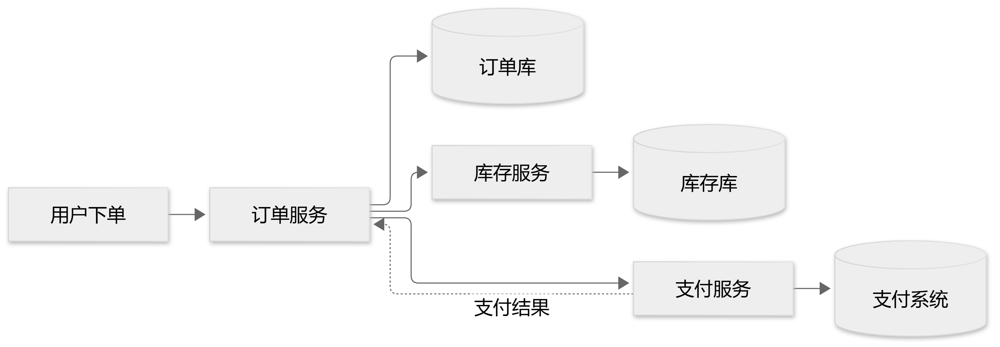
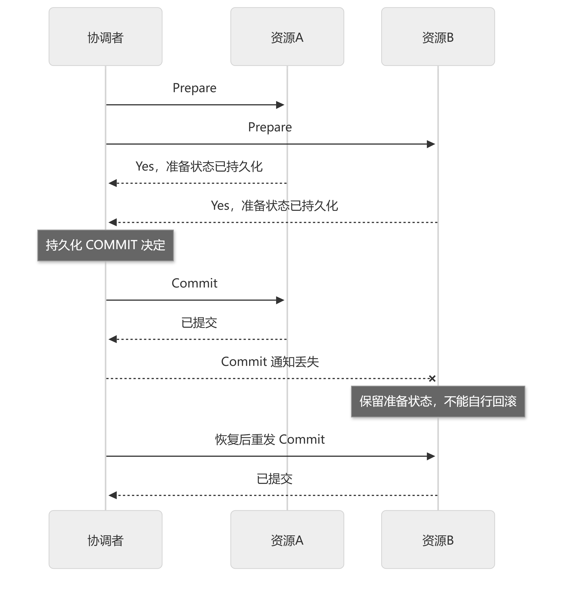
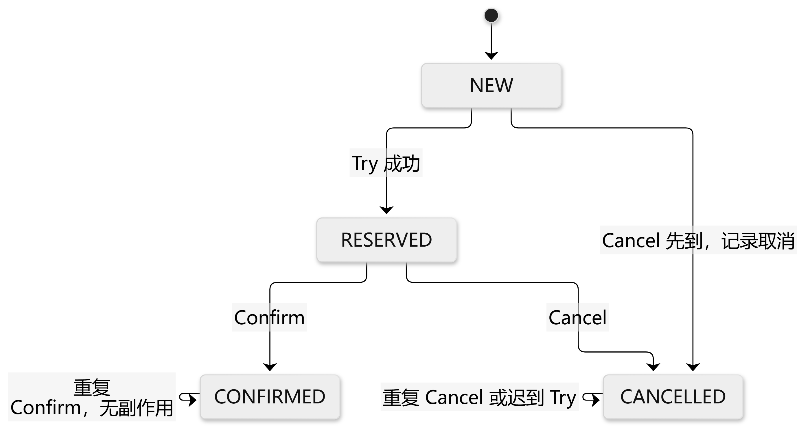
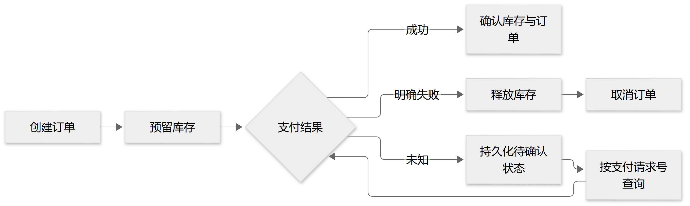
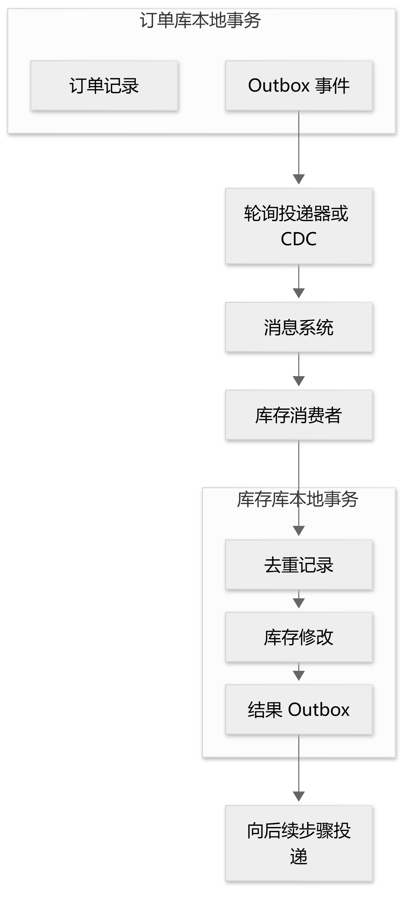
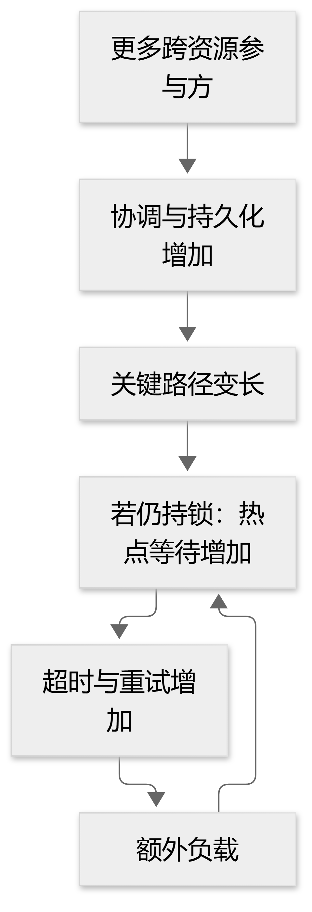

# 一笔订单，三个服务：把分布式事务讲清楚

用户下了一笔订单，库存扣了，支付接口却超时了。

这时，你敢直接退款吗？敢重新扣款吗？敢把订单标记为失败吗？

问题在于：**超时只说明调用方没有及时拿到结果，并不说明对方没有成功。** 钱可能已经扣了，只是响应丢在网络里。

分布式事务最难的地方，就藏在这种“我不知道你到底做没做完”的时刻。

## 01 从一个数据库，变成三个独立的世界

如果订单和库存在同一个数据库中，我们可以把创建订单、扣减库存放进同一个事务。成功就一起提交，失败就一起回滚。

服务拆分后，订单服务管订单库，库存服务管库存库，支付服务还可能连接第三方支付系统。



每个服务都能保证自己的本地事务，但它们未必能同时成功。

在订单服务上加一个本地事务注解，并不能让远端的支付也跟着回滚。数据库管理的是自己的提交边界，不是整条业务调用链。

因此，先别急着选框架。我们应该把必须守住的规则写下来：库存不能超卖；同一支付意图不能重复扣款；订单完成前，库存和支付都要确认；已付款但无法履约，必须进入可追踪的退款流程。

**这些业务规则，才是设计的起点。**

订单短暂显示“处理中”是否可以接受？退款是否允许延迟？资源能否提前预留？答案不同，合适的方案也不同。

## 02 四种方案，分别把问题放在哪里解决？

### 2PC：提交前，先统一意见

两阶段提交先让所有参与者准备，再由协调者作出统一决定。

可以理解为：先确认大家都做好了提交准备，再统一通知提交。如果有人拒绝，就不能提交全局事务。



难点出现在参与者已经回答“准备好了”，却迟迟收不到最后的决定。

它不能因为超时就自行回滚：其他参与者可能已经收到提交通知并执行成功。此时需要依靠持久化记录和恢复机制继续推进。

这也是经典 2PC 可能阻塞的原因。准备期间相关锁可能还被占着，后面的业务只能等待。

XA 是资源与事务管理器协作的接口规范，2PC 是提交协议。工程上可以研究 Narayana 等事务管理器，但前提是资源能够参与对应协议。普通 HTTP 支付接口不会自动变成 XA 资源。

### TCC：先把资源留出来

购买两件商品，Try 阶段先预留两件库存；成功后 Confirm，把预留转成已售；失败后 Cancel，释放预留。



注意，Try 不是只查一下“还有两件”。如果没有真正预留，等到确认时，这两件可能早被别人买走了。

TCC 把控制能力交给业务，也把实现责任交给业务。确认重复到达，不能重复扣库存；取消先到、预留后到，也不能在取消之后重新占用资源。

Seata 提供 TCC 接口与 Fence 机制，但开发者仍需设计自己的资源状态和业务唯一约束。框架知道分支事务的状态，不会自动理解“同一订单不该预留两次”。

### Saga：先走流程，失败再补偿

Saga 把长流程拆成多个本地事务。创建订单成功，库存预留成功，支付明确失败，就释放库存并取消订单。



如果已经扣款，补偿可能是退款。退款是一笔新的业务操作，不是数据库时间倒流：它会产生记录，也可能失败，需要继续跟踪。

因此，**补偿不等于回滚。** 已经发出的通知、已经交付的服务，也未必能完全撤销。

Saga 可以由协调者按步骤推动，也可以由各服务监听事件继续执行。DTM 就提供了声明正向动作与补偿动作的接口。

顺便说一句，Saga 并不是微服务时代的新发明。1987 年的原始论文就讨论了长事务占用资源的问题。今天只是把这种思路应用到了更多跨服务流程中。

### Outbox：让业务变化可靠地传出去

不少系统的写法是：先提交订单，再发消息。

如果进程恰好在两步之间崩溃，就留下一个已经创建、却没有通知下游的订单。

Outbox 把“订单记录”和“待发送事件”放进同一个本地事务，再由后台投递器或 CDC 组件发送出去。



核心代码其实很短：

```sql
BEGIN;
INSERT INTO orders (...) VALUES (...);
INSERT INTO outbox_event (...) VALUES (...);
COMMIT;
```

这是结构示意，省略了字段和参数。关键在于：两次写入必须使用同一个数据库事务。

Debezium 可以从数据库变更日志捕获 Outbox 事件并投递，但投递仍可能重复。消费端要把去重记录、业务修改、结果事件也放进同一个本地事务。

Outbox 负责可靠传播，不会让整个流程自动变成原子事务。它常常与 Saga 组合：一个负责流程，一个负责事件可靠地到达。

## 03 一笔订单，可以怎样落地？

假设业务允许短暂的“处理中”，库存能够预留，支付方支持幂等请求与结果查询。

可以这样设计：

1. 创建订单，与 Outbox 事件一起提交。
2. 库存服务消费事件，去重并预留库存。
3. 使用固定支付请求号发起支付。
4. 支付超时，保存“结果待确认”，继续查询或同键安全重试。
5. 支付成功后确认库存，所有条件满足再完成订单。
6. 支付明确失败则释放库存；已经付款但无法履约则进入退款流程。

整个过程中，每一步都要有持久化状态。否则进程一重启，系统就不知道“钱到底扣了吗、库存还要不要释放”。

还有一个容易遗漏的情况：支付结果未知时，用户申请取消。不能简单把订单改成取消就结束，还要处理迟到的支付成功，并决定是否退款。

状态机和对账，正是在解决这些边界问题。

## 04 性能到底会损失多少？

分布式事务会增加通信、日志和恢复工作，但最容易被低估的，是等待期间占用资源。



以同一条热点库存记录为例。在极简串行模型中，持锁 5 毫秒，理论上限约为每秒 200 次；持锁 50 毫秒，上限就变成每秒 20 次。

这不是数据库实测 TPS，而是说明：一次调用多等几十毫秒，可能让后面一整串请求排队。

真实论文里也有量化数据。Spanner 2012 年论文测试了 2PC 的扩展性，在 3 个 zone、每个 zone 25 台 spanserver 的环境下：

- 1 个参与方，平均延迟 17.0 ms。
- 2 个参与方，平均延迟 24.5 ms。
- 5 个参与方，平均延迟 31.5 ms。
- 100 个参与方，平均延迟 71.4 ms。

按均值算，2 个参与方比 1 个增加约 44%，100 个约为基线的 4.2 倍。

这组历史数据说明跨资源范围会影响成本，但不能换算成“多一个微服务就慢多少”，更不是今天某个产品的性能承诺。

异步也不意味着成本消失。入口每秒接收 1,000 笔，后台只能处理 800 笔，一分钟就多出约 12,000 笔积压。接口可能一直很快，订单完成却越来越慢。

所以至少要同时看：接口返回时间、业务完成时间、唯一成功业务的吞吐，以及故障后的积压恢复时间。

## 05 真正值得带回项目的三个问题

第一，哪些规则必须立即成立，哪些状态允许短暂不一致？

第二，发生超时或崩溃后，事实保存在哪里，由谁继续推进？

第三，同一个动作执行两遍、取消先于正向动作到达，系统还能保持正确吗？

能放进合理的本地事务，就先用本地事务。必须跨资源原子提交，再评估 XA；资源能预留，研究 TCC；流程较长且允许补偿，研究 Saga；事件需要可靠传播，研究 Outbox。

实际系统通常会组合这些能力。无论选择哪条路，幂等、持久化状态、有限重试、对账和异常处理都需要落实。

下一次画下单流程图时，可以在每个提交点旁边加一个问题：**如果进程就在这里崩溃，重启以后怎么办？**

沿着这条线追下去，往往能发现正常流程图上看不到的问题。

---

延伸阅读与代码资料：

1. Sagas（1987）：https://www.cs.princeton.edu/research/techreps/598
2. Consensus on Transaction Commit：https://www.microsoft.com/en-us/research/publication/consensus-on-transaction-commit/
3. Spanner（Table 4）：https://www.usenix.org/system/files/conference/osdi12/osdi12-final-16.pdf
4. Seata TCC：https://seata.apache.org/blog/seata-tcc-fence/
5. DTM Saga：https://en.dtm.pub/guide/e-saga
6. Debezium Outbox：https://debezium.io/documentation/reference/stable/transformations/outbox-event-router.html

完整技术版（含开源接口示例与压测方法）：https://myblog-43r.pages.dev/posts/distributed-transactions/
