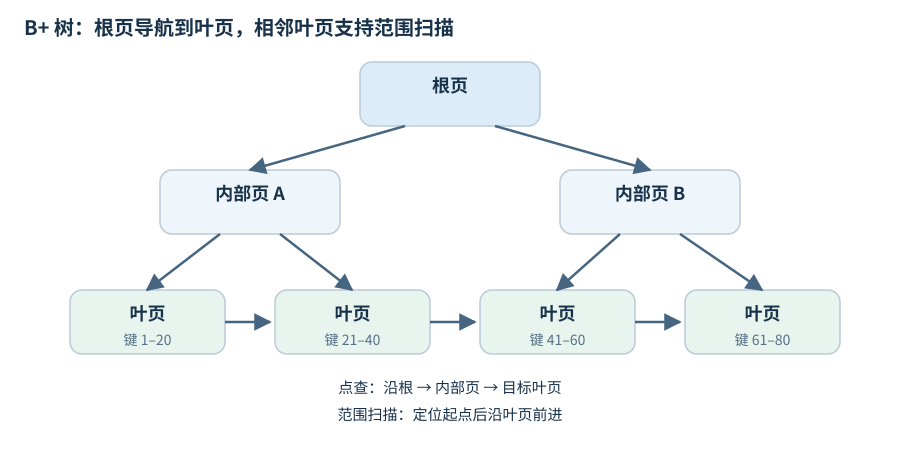
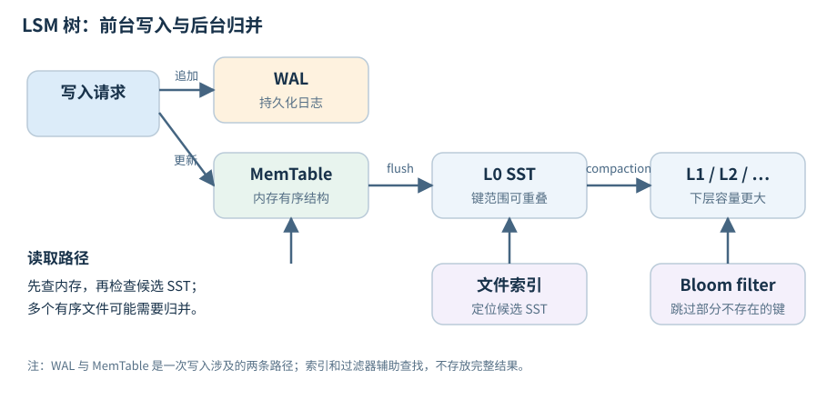
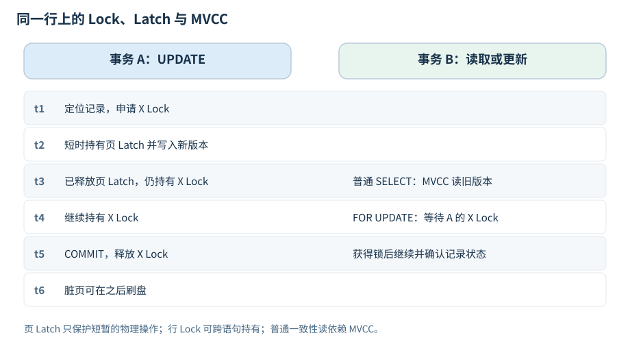

# B+ 树与 LSM 树：读写方式与性能取舍

假设数据库里有一条 `id=42, balance=100` 的记录，现在要把余额改成 `120`。数据库该怎么保存这个变化？

一种做法是找到这条记录所在的页，把值改掉。另一种做法是先记下一条新记录：`id=42` 的余额现在是 `120`，等以后再整理新旧数据。

这就是理解 B+ 树和 LSM 树的起点。**B+ 树通常在目标页上更新数据；LSM 树先接收新版本，再在后台批量归并。** 两者都能点查，也都能做范围查询，只是整理数据的时机不同。这个选择会一路影响写入吞吐、查询开销、磁盘占用，甚至系统忙起来时的延迟。

数据库语境里的“B 树”通常指 B+ 树，下面也主要讨论 B+ 树。文章参考了[《详解常用存储结构：B+树、B-Link树、LSM树》](https://zhuanlan.zhihu.com/p/591444516)的讨论，并保留相关论文和实现文档，方便继续查阅。

## 1. B+ 树：找到目标页，再更新它

数据库通常按页读写数据。既然读一个键也要把它所在的页读进来，不如在一页里放下许多键，让一次读盘尽可能多地缩小查找范围。

B+ 树就是这样组织数据的：内部节点保存用于导航的键和子节点指针，叶子节点保存记录或记录的位置。一个内部节点可以指向很多子节点，因此即使数据量很大，树也不必很高。



查询 `id=42` 时，从根节点开始，根据键的范围一路向下，最后到达对应叶页。根页和内部页如果已经在缓存里，这条路径上的大部分工作都在内存中完成，真正需要读盘的可能只有叶页。

查询 `id` 从 `42` 到 `100` 的记录也很自然：先找到起点，再沿叶页之间的链接向后扫描。不过，**叶页在键序上相邻，不代表它们在磁盘上一定连续**；如果叶页存的只是记录位置，读取完整记录还可能需要额外访问数据页。

更新时，数据库同样先定位叶页，再修改其中的记录。页满了，插入可能触发分裂；删除留下的空位则可以稍后整理，不必每删一条就合并页面。

这里有个容易误会的地方：“修改目标页”不等于“每写一条记录，就同步把整个页写到磁盘”。常见实现会先修改缓存中的页，通过 WAL（预写日志）保证崩溃后能够恢复，脏页再由后台批量刷盘。B+ 树同样可以使用 WAL，例如 [SQLite 就支持这种组合](https://www.sqlite.org/wal.html)。

B+ 树的好处是查询路径明确，数据也一直按键组织。它的压力主要出现在大量分散写入时：这次改一页，下次又改另一页，如果这些页不在缓存里，就需要不断读取和更新不同位置的数据。

## 2. LSM 树：先把写入接住，稍后再整理

如果业务持续写入大量随机键，能不能先把这些写入攒起来，排好序，再成批写出去？

LSM 树采用的就是这个思路。一次写入通常先追加到 WAL，并更新内存中的有序结构 MemTable。MemTable 达到一定大小后，会被冻结，由新的 MemTable 接收写入；冻结的那份则刷成磁盘上的有序文件，通常称为 SST。



SST 写好后通常不再原地修改。更新 `id=42` 时，LSM 会写入它的新版本；删除时，也通常先写一个删除标记，称为 tombstone（墓碑）。

于是，同一个键可能暂时出现在多个地方：旧值在某个 SST 里，新值在 MemTable 或较新的 SST 里。数据库必须在读取时辨认出当前可见的版本。

### 写得进去，还得整理得过来

随着 MemTable 不断刷盘，SST 会越来越多。后台需要挑选一些文件，把其中的有序数据归并，清理已经不需要的旧版本，再生成新的 SST。这个过程叫 **compaction**。

这里的“清理”有条件。例如，仍被快照引用的旧版本不能删除；如果更旧的文件里还可能存在某个键，过早丢掉它的墓碑，就可能让已删除的数据重新出现。

LSM 把许多零散写入转成批量工作，前台因此更容易获得较高吞吐。但这部分整理成本始终存在：compaction 会读取数据，也会重写数据，占用 CPU、I/O 带宽和临时磁盘空间。

**写入速度如果长期超过后台整理速度，积压最终会回到前台。** 数据库可能先限速，再暂停写入，等待 flush 或 compaction 赶上。所以评估 LSM，不能只看刚开始导入时写得多快，还要看持续运行后能否保持这个速度。

### 查询要把分散的数据重新合起来

点查时，LSM 会先检查内存，再根据文件范围、版本顺序等信息查找可能包含目标键的 SST。这里有两个常用帮手：索引用来定位文件内的数据块，Bloom filter 用来排除不可能包含目标键的文件或数据块。

Bloom filter 的回答是不对称的：它说“不在”，就可以跳过；它说“可能在”，仍要检查实际数据。因此它对查询不存在的键尤其有用，但不能直接返回记录。具体实现可看 [RocksDB 的 Bloom filter 说明](https://github.com/facebook/rocksdb/wiki/RocksDB-Bloom-Filter)。

范围查询则需要同时遍历多个有序数据来源，把结果按键归并，再处理重复版本和墓碑。点查可以靠过滤器跳过很多无关文件，范围扫描却仍要读取并合并范围内的数据。

## 3. 差别到底落在哪里？

还是看两类操作。

一批随机更新到来时，B+ 树可能要修改很多分散的叶页；LSM 则先在内存中接收更新，之后批量刷盘和归并。前者的压力更接近目标页的访问与修改，后者的压力更多落在持续的后台整理上。

扫描一段连续键时，B+ 树找到起点后就能沿叶页向前走；LSM 可能要从多个文件中同时读取，再合成一个结果流。文件整理得越充分，读取通常越省事，但整理本身又需要付出写入成本。

| 关注点 | B+ 树 | LSM 树 |
|---|---|---|
| 点查 | 沿树定位叶页，路径较明确 | 可能检查多个文件，依赖索引、过滤器和缓存减少访问 |
| 范围扫描 | 定位起点后沿叶页遍历 | 合并多个有序数据来源，处理重复版本和墓碑 |
| 大量随机写入 | 可能频繁触及不同叶页 | 先缓冲，再批量刷盘和归并 |
| 延迟波动 | 页分裂、缓存未命中、日志刷盘和并发争用都可能影响延迟 | 后台整理积压时，可能限速或停写 |
| 空间占用 | 页内空闲、碎片和旧版本会占空间 | 旧版本、墓碑和归并过程中的新旧文件会占空间 |

这也解释了为什么“LSM 写快，B+ 树读快”只能作为初步印象。缓存足够大、写入有局部性时，B+ 树的更新可能很高效；过滤器和缓存配置得当时，LSM 的点查也可以很快。

磁盘类型同样会改变结果。机械硬盘上，随机寻道很贵，批量顺序 I/O 的优势明显；SSD 降低了随机访问的成本，但没有消除缓存、带宽和设备内部写放大的影响。数据结构给出了取舍方向，具体快多少还得测。

## 4. 看性能时，要把后台的账也算上

讨论存储引擎时，经常会遇到“三种放大”。它们分别回答三个问题：

- **读放大**：为了完成一次查询，实际多读了多少数据、访问了多少位置？
- **写放大**：应用写入一份数据后，日志、刷盘和后续整理累计写出了多少数据？
- **空间放大**：为了保存当前有效数据，还额外占用了多少空间？

以 LSM 为例，一条记录先写 WAL，再随 MemTable 刷成 SST，以后还可能在多次 compaction 中被重写。只计算前台追加日志的成本，会漏掉很大一部分工作。

B+ 树也有写放大：改动少量字节，最终可能要刷出整页，此外还要维护日志和其他索引。一次逻辑更新与一次设备写入之间，并没有简单的一一对应关系。

比较指标前，还要看口径是否一致。有的写放大统计包含 WAL，有的只算 compaction；空间占用可以看平时，也可以看归并时的峰值。口径不同，数字就不能直接比较。

除了这三种放大，还应观察 **P99 延迟**：绝大多数请求很快，并不代表后台整理、刷盘或页分裂发生时，最慢的那部分请求也能满足要求。

### 如果想用公式理解

设数据共有 `N` 个键，每页可以容纳约 `B` 个键，B+ 树点查的页访问量级是 `O(log_B N)`。缓存会减少实际读盘次数，因此树高不能直接当作每次查询的磁盘 I/O 次数。

对 LSM，设内存可容纳 `M` 个键，相邻层容量比为 `T`，磁盘层数可以粗略写成 `L ≈ log_T(N/M)`。但光知道层数还不够：每层有多少个有序数据集合，以及它们的键范围是否重叠，都会影响读取和归并成本。

经典模型中，leveled compaction 的摊销写成本通常随 `T·L` 增长，tiered 则通常随 `L` 增长。这适合用来理解参数变化的方向，不能直接拿来预测某块 SSD 最终会写多少字节。更完整的假设和分析可参考 [LSM 技术综述](https://arxiv.org/abs/1812.07527)。

## 5. LSM 的不同方案，主要在调整归并方式

理解 compaction 后，再看 LSM 的各种变形就容易了：它们大多在决定，文件攒到什么时候合并、一次合并多少，以及愿意为读取多做多少整理。

### Leveled：多整理一些，让读取省事

Leveled compaction 把数据组织成容量逐渐增大的层。除 L0 外，同一层的文件键范围通常不重叠，因此查询一个键时，每层一般只需考虑一个对应文件。

代价是跨层归并时，需要把下一层中键范围重叠的数据一起读出、重写。同一份数据可能被多次搬运，写放大因此较高。它用更多后台写入，换取较少的查询候选文件和更可控的空间占用。

### Tiered：多攒一些再合并，减少搬运

Tiered 的思路是允许多个有序数据集合并存，达到条件后再合并。这里的一个有序集合常被称为一个 **run**，它可以由一个或多个文件组成。

减少归并频率通常能降低写放大，但查询可能要检查更多 run，合并时也可能需要更大的临时空间。Size-tiered 和 RocksDB 的 Universal 都与这类思路有关，具体规则则各有不同。

两类策略的实现细节可看 [RocksDB compaction 概览](https://github.com/facebook/rocksdb/wiki/Compaction)、[Leveled 说明](https://github.com/facebook/rocksdb/wiki/Leveled-Compaction)和 [Universal 说明](https://github.com/facebook/rocksdb/wiki/Universal-Compaction)。

### 其他优化，往往针对特定负载

| 方案 | 适合解决什么问题 | 要付出什么代价 |
|---|---|---|
| FIFO、按时间窗口整理 | 日志、时序等数据常按时间过期，可以利用这一特点组织或淘汰文件 | 对旧数据反复更新、过期规则复杂的负载，需要额外考虑清理语义 |
| Bloom filter、分区过滤器 | 减少无结果点查的 I/O，控制过滤器的缓存占用 | 占用内存和存储，也有构建成本 |
| 键值分离 | 值很大时，让 LSM 主要归并键和位置，避免反复搬运大值 | 读值需要额外寻址，独立的值日志还要做垃圾回收 |
| Fragmented LSM | 减少归并过程中被迫重写的数据范围 | 读路径和文件管理更复杂 |

键值分离的代表是 [WiscKey](https://www.usenix.org/conference/fast16/technical-sessions/presentation/lu)，Fragmented LSM 可以看 [PebblesDB 的论文介绍材料](https://sigops.org/s/conferences/sosp/2017/slides/pebblesdb-sosp17-slides.pdf)。这些优化有的改变归并策略，有的改变值的存放方式，不必把每一项都当成一种全新的树。

调参也遵循相似的取舍。更大的 MemTable 通常可以减少刷盘频率，但会占用更多内存，并可能增加恢复时要重放的日志量；允许更多 run 并存，可以减少归并，却增加读取负担；给 Bloom filter 更多空间，能降低误判率，却无法省掉范围扫描中的数据归并。

## 6. B+ 树也有很多改进方向

B+ 树并不只有“原地改页”这一种实现。围绕并发、快照和批量写入，也发展出了不少方案。

**B-link tree 主要解决并发分裂时的查找问题。** 叶页分裂后，父节点中的导航信息可能还没来得及更新。B-link tree 为节点增加右兄弟指针和键范围上界，读者即使沿旧路径到达某个节点，也可以继续向右找到正确位置，从而减少分裂期间的协调。详见 [Lehman–Yao 论文](https://pages.cs.wisc.edu/~yxy/cs764-f20/papers/blink.pdf)。

**Bw-tree 把节点修改记录成增量。** 它通过映射表和原子操作安装新的 delta 记录，再定期整合增量链，以减少页级 latch 争用。代价是读者要处理这些增量，系统也需要管理映射表和内存回收。详见 [Microsoft Research 的 Bw-tree 论文](https://www.microsoft.com/en-us/research/publication/bw-tree-latch-free-b-tree-log-structured-flash-storage/)。

**Copy-on-write B 树通过复制页面保留旧状态。** 更新时复制受影响的页，再切换根指针，便于实现快照和崩溃一致性，但要承担页面复制与空间回收的成本。

**Bε tree 在树的内部节点设置缓冲区。** 更新先作为消息进入缓冲，再成批向下传递，从而减少零散写入。查询则需要检查路径上尚未下推的更新。它保留了树形导航，也借用了批量处理的思路，原理可参考 [Bε tree 介绍](https://people.csail.mit.edu/bradley/papers/BenderFaJa15.pdf)。

因此，“B+ 树还是 LSM”是一个有用的讨论入口，但现实中的设计还可以在两者之间寻找折中。

## 7. 表怎么存、事务怎么隔离，是另外两件事

到这里，我们一直在讨论数据结构。落实到数据库时，还需要区分表的布局、事务锁和内部同步，否则很容易把某个引擎的行为归因于“用了哪种树”。

### 叶页里存的是整行，还是记录位置？

聚簇表把记录放在主索引的叶页里；堆表把记录放在独立的数据页里，索引再指向它们。两者都可以使用 B+ 树索引，但读取完整记录的路径不同。

例如，InnoDB 的聚簇索引叶页包含行数据，二级索引记录中则包含主键。通过二级索引找到一条记录后，如果还需要索引中没有的列，就可能继续查聚簇索引，也就是通常说的“回表”。这部分开销来自数据布局和访问路径。详见 [InnoDB 索引类型](https://dev.mysql.com/doc/refman/9.7/en/innodb-index-types.html)。

所以，同样使用 B+ 树的两个查询，也可能因为是否回表、读取多少列、缓存是否命中而相差很大。

### Lock 和 Latch 各自保护什么？

中文里都叫“锁”，但在存储引擎中，两者的用途和持有时间差别很大。

**Lock（事务锁）约束事务之间的访问。** 例如一个事务更新了某条记录，在它提交之前，另一个事务不能随意覆盖这次更新。这类锁可能一直持有到事务结束。

**Latch 保护内存中的数据结构。** 例如线程正在修改一个索引页，其他线程不能同时看到一个只改了一半的页。完成这次物理操作后，Latch 就应尽快释放。

用 InnoDB 的一个例子更容易说明。事务 A 执行：

```sql
UPDATE t SET v = 2 WHERE id = 1;
-- 暂不提交
```

A 会持有相关索引记录上的排他 Lock，但修改页时使用的短时 Latch 不会一直持有到提交。

这时，事务 B 如果在 RC/RR 隔离级别下执行普通一致性读，通常不必等待 A 的记录锁，而是根据 Read View，通过 undo 找到自己可见的版本。如果 B 执行 `SELECT ... FOR UPDATE`，或者更新同一条记录，就需要等待冲突的事务锁。



| 操作 | 事务锁的作用 | 内部同步的作用 |
|---|---|---|
| 普通一致性 `SELECT` | 通常不加行锁，由 MVCC 确定可见版本 | 安全访问页及相关结构 |
| `SELECT ... FOR UPDATE` | 对相关索引记录或范围加锁，冲突时等待 | 在定位、读取和锁管理过程中短暂协调 |
| `UPDATE` / `DELETE` | 阻止冲突的并发操作 | 保护页修改及相关内部状态 |
| 后台刷脏页 | 不等于重新申请用户行锁 | 安全访问或复制页面状态 |

这里没有一条通用的“先 Latch、再 Lock、最后一起释放”的固定流程。申请事务锁时可能需要多种内部同步；发生事务锁等待，也不能因此一直占着相关页 Latch。普通读是否看见某个版本，主要由隔离级别和 MVCC 决定，不能只靠行锁来解释。

A 提交后，事务锁可以释放，数据页仍可能是缓存中的脏页，等待之后刷盘。记录锁也不等于锁住整张数据页；具体访问路径还可能涉及间隙锁、next-key 锁等。相关机制可查阅 [InnoDB 锁类型](https://dev.mysql.com/doc/refman/8.4/en/innodb-locking.html)、[一致性读](https://dev.mysql.com/doc/refman/8.4/en/innodb-consistent-read.html)和[加锁读](https://dev.mysql.com/doc/refman/8.4/en/innodb-locking-reads.html)。

B+ 树的分裂需要并发协调，LSM 的 MemTable、WAL、文件版本切换和 compaction 也同样需要。是否使用某种锁、锁的粒度有多大，要看具体实现。

排查问题时也要分开看：事务数据锁可以查 `performance_schema.data_locks` 和 `data_lock_waits`；内部同步争用则可以看 Performance Schema 的 mutex/rwlock 等待，以及 `SHOW ENGINE INNODB STATUS` 的 `SEMAPHORES` 部分。参考[数据锁表](https://dev.mysql.com/doc/refman/8.4/en/performance-schema-data-locks-table.html)和 [InnoDB Monitor](https://dev.mysql.com/doc/refman/8.4/en/innodb-standard-monitor.html)。
