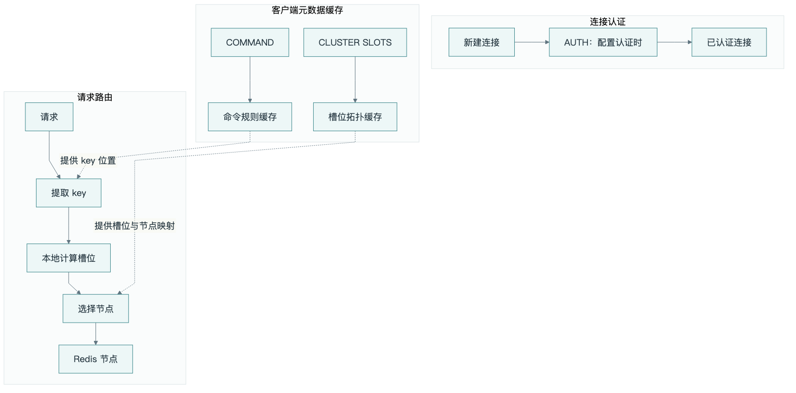

# 从 go-redis V8 看 Redis 的连接与集群命令

go-redis 在执行请求的过程中，还会完成认证、寻找节点、维护连接和处理重定向。这些过程涉及多组 Redis 命令。


沿着一条连接从建立到执行请求的过程，可以把这些命令串起来理解。下面用箭头表示顺序；括号标注可选步骤、本地操作或服务端响应。

先看两条主线：

> 普通连接：建连 → AUTH（按配置）→ SELECT（按配置）→ 执行请求 → 归还连接池

> 集群连接：连接种子节点 → CLUSTER SLOTS → 本地计算槽位 → 选择目标节点 → 执行请求

连接复用时会跳过已经完成的初始化；集群路由也优先使用本地保存的拓扑。



## 连接建立后，先完成认证和选库

TCP 连接成功，只表示网络已经连通。Redis 是否允许访问、这条连接使用哪个数据库，还需要进一步设置。

普通连接的初始化：

> TCP 建连 → TLS（可选）→ AUTH（配置认证时）→ SELECT（非零 DB）→ CLIENT SETNAME（OnConnect 中设置时）→ 执行请求

**AUTH 负责认证。** 配置了密码后，go-redis 会在新连接上发送 AUTH。如果同时配置用户名，就使用用户名和密码认证；只传密码时，对应 Redis 的 default 用户。

**SELECT 负责选库。** 普通客户端配置非零 DB 时，会在初始化连接时切换到指定数据库。Redis Cluster 只支持 DB 0，集群连接统一使用这个数据库。

这两项都是连接上的状态。连接池后来新增一条连接，也需要完成初始化；已经初始化的连接再次被借出时，会继续使用已有的认证和选库状态。

还有一个常见命令是 **CLIENT SETNAME**，用于给连接起名字。比如把名称设成服务名，排查时就更容易找到连接来源。在 go-redis V8 中，可以通过 OnConnect 设置。

Redis 还提供 **HELLO**，用于协商 RESP 协议，并可合并认证、连接命名等握手信息。go-redis V8 默认沿用 RESP2，通过 AUTH 等命令完成连接初始化。

例如，在一条新连接上发送下面的命令（用户名和密码为示例）：

```text
HELLO 3 AUTH app_user example_password SETNAME order-service
```

这条命令一次完成三件事：

- **3**：使用 RESP3，也就是客户端与 Redis 之间的一种响应编码格式。
- **AUTH app_user example_password**：使用这个用户名和密码认证。
- **SETNAME order-service**：把当前连接命名为 order-service，方便通过 CLIENT LIST 查看来源。

> 新连接 → HELLO 3 AUTH … SETNAME … → 返回握手信息 → 后续按 RESP3 通信

执行成功后，Redis 会返回服务端版本、连接 ID、协议版本等信息，协议字段为 `proto: 3`。前提是服务端支持 HELLO、账号密码正确，并且客户端能够解析 RESP3 响应。

go-redis V8 默认使用 RESP2。配置认证，并在 OnConnect 中设置连接名时，对应的过程是：

```text
AUTH app_user example_password
CLIENT SETNAME order-service
```

> 新连接（默认 RESP2）→ AUTH → CLIENT SETNAME → 后续按 RESP2 通信

HELLO 中的 `3` 指协议版本，和 go-redis V8 的版本号没有关系。这个例子用于说明 HELLO 的作用；go-redis V8 的连接应继续使用它支持的 RESP2。

支持 HELLO 握手的客户端可以这样协商：

> TCP / TLS 建连 → HELLO（协议版本，可附带 AUTH、SETNAME）→ 按协商结果通信

参考：[连接初始化源码](https://github.com/redis/go-redis/blob/v8.11.5/redis.go)、[HELLO 文档](https://redis.io/docs/latest/commands/hello/)。

## RESP2 与 RESP3：命令和结果的传输格式

**RESP 是 Redis 客户端与服务端交换消息的编码协议**，全称 Redis Serialization Protocol。客户端把命令编码成字节发送，Redis 执行后再按协议返回结果。

> Go 方法调用 → RESP 编码 → 网络传输 → Redis 执行 → RESP 响应 → 客户端解码

常见的是 RESP2 和 RESP3。RESP2 支持字符串、错误、整数、数组等基础类型；RESP3 增加了 Map、Set、布尔值、浮点数和推送消息等类型。

例如，一个 Hash 保存了 `name=Alice`、`age=20`。执行 `HGETALL user:1` 后，两种协议可以这样表达结果。下面是便于理解的数据结构示意：

```text
RESP2：交替排列的数组
["name", "Alice", "age", "20"]

RESP3：直接表达键值关系的 Map
{"name": "Alice", "age": "20"}
```

> RESP2 数组 → 客户端按 HGETALL 规则组合键值对 → Go 中的 Map

> RESP3 Map → 客户端解码键值关系 → Go 中的 Map

两种协议最终都能让应用拿到键值结果，区别在于线上消息如何表达类型。Hash 的值仍是字符串，所以示例中的 `20` 带引号。

Redis 服务端版本、go-redis 库版本、RESP 协议版本分别编号。go-redis V8 默认使用 RESP2；支持 RESP3 的客户端通过 HELLO 协商协议。

具体命令的返回内容也有自己的结构。例如 COMMAND 返回的每条命令描述增加字段时，RESP2 仍然能编码这个更长的数组，客户端则需要同步适配字段解析。

参考：[RESP 协议说明](https://redis.io/docs/latest/develop/reference/protocol-spec/)。

## 连接池复用与 PING 探活

**PING** 用来检查 Redis 是否能响应，也可以测量一次请求的往返时间。应用启动探活、健康检查经常用到它。

go-redis V8 在本地完成取连接、归还连接、等待空闲名额和关闭过期连接。正常借用连接时直接执行请求。

连接复用：

> 取空闲连接（本地）→ 执行请求 → 读取响应 → 归还连接（本地）

没有空闲连接时：

> 获取池名额 → 新建连接 → AUTH（按配置）→ SELECT（按配置）→ 执行请求

> 池名额已满 → 等待归还 → 超过 PoolTimeout → 返回连接池超时

在某些功能中，客户端会主动使用 PING：例如集群开启 RouteByLatency 后，会通过 PING 采样节点延迟。

探活与延迟采样：

> PING → PONG（响应）→ 记录是否可用及往返耗时

这里可以区分三个动作：

- **TCP keepalive**：操作系统层面的连接探测。
- **PING**：真正发给 Redis 的命令，需要服务端回复。
- **连接池超时**：等不到可用连接，本次请求可能还没有发给 Redis。

go-redis V8 的 Close 直接关闭连接池和底层 socket。

> Close()（本地）→ 关闭连接池 → 关闭 socket

参考：[连接池源码](https://github.com/redis/go-redis/blob/v8.11.5/internal/pool/pool.go)、[集群延迟采样](https://github.com/redis/go-redis/blob/v8.11.5/cluster.go)。

## 集群访问先解决“去哪个节点”

普通客户端知道一个目标地址就能发请求。ClusterClient 还需要知道不同 key 应该发往哪个节点。

这里有两个步骤：先算出 key 的槽位，再查出槽位对应的节点。

### COMMAND：让客户端了解命令的规则

**COMMAND 返回服务器支持的命令及其属性。** 可以把它理解成 Redis 提供给客户端的一份“命令说明清单”。里面包括命令名、参数数量、读写标志，以及 key 在参数中的位置等信息。

例如，手动查询 GET 的说明：

```text
COMMAND INFO GET
```

其中的部分信息可以读成：

- 命令名是 `get`。
- 参数数量是 2，包含命令名本身，对应 `GET key`。
- 带有 `readonly` 标志，表示命令只读取数据。
- 第一个 key 位于参数位置 1，位置 0 是命令名。

> COMMAND INFO GET → 获取 GET 的参数和属性说明

直接执行 `COMMAND` 则获取所有命令的说明。go-redis V8 的 ClusterClient 会在需要命令信息时按需加载这份清单，成功后保存在客户端内存中。

> 首次需要命令信息 → COMMAND → 解析结果 → 缓存命令规则

> 后续请求 → 查命令规则缓存 → 找到 key 参数 → 本地算槽位 → 查拓扑 → 选择节点

key 的位置帮助客户端计算路由；只读标志则帮助它在开启副本读时选择合适的节点。对于 EVAL 等参数结构特殊的命令，客户端还会结合专门的处理逻辑。

这份缓存属于 ClusterClient 对象。创建新的客户端对象后，需要重新加载；同一个对象下仅仅重建 TCP 连接，已经加载的命令规则仍保留在内存中。普通 NewClient 直接向指定地址发请求，默认初始化只执行连接所需的步骤。

开发者也可以手动执行 `COMMAND INFO 命令名`，检查服务端是否支持某条命令、参数如何组织。日常应用请求中的元数据加载由 ClusterClient 管理。

参考：[COMMAND 文档](https://redis.io/docs/latest/commands/command/)、[集群客户端实现](https://github.com/redis/go-redis/blob/v8.11.5/cluster.go)、[命令信息缓存](https://github.com/redis/go-redis/blob/v8.11.5/command.go)。

### 槽位在本地算，拓扑向 Redis 查

Redis Cluster 有 **16384 个槽位**。go-redis 在本地根据 key 计算槽位。

如果 key 中有有效的 hash tag，例如 `order:{42}` 和 `user:{42}`，客户端会用相同的 `42` 计算槽位，让它们落在同一个槽位。

**CLUSTER KEYSLOT** 也能查询 key 的槽位，适合手动验证分片结果。

知道槽位后，客户端通过 **CLUSTER SLOTS** 获取槽位范围与主从节点的对应关系，并保存在内存中。初始化或刷新拓扑时重新加载，日常请求使用本地映射。

种子节点用于发现集群。客户端拿到拓扑后，会直接连接其他节点，因此需要保证拓扑中各节点地址都可达。

Redis 后续还提供了 **CLUSTER SHARDS**，用更完整的结构描述分片和节点。go-redis V8 默认使用的是 CLUSTER SLOTS。

加载拓扑与路由：

> 连接种子节点 → CLUSTER SLOTS → 缓存“槽位—节点”映射

> 提取 key / hash tag → 本地计算槽位 → 查询拓扑缓存 → 连接目标节点 → 执行请求

手动查看槽位或其他拓扑接口：

> CLUSTER KEYSLOT order:{42} → 返回槽位编号

> CLUSTER SHARDS → 返回分片及节点信息（另一种接口，非 V8 默认流程）

参考：[本地槽位计算](https://github.com/redis/go-redis/blob/v8.11.5/internal/hashtag/hashtag.go)、[CLUSTER SLOTS](https://redis.io/docs/latest/commands/cluster-slots/)、[CLUSTER SHARDS](https://redis.io/docs/latest/commands/cluster-shards/)。

### 节点发生变化，就需要重定向

集群扩缩容或槽位迁移时，客户端缓存的路由可能与服务端当前状态不同。服务端会通过 **MOVED** 或 **ASK** 告诉客户端下一步去哪里。

它们都是服务端返回的错误响应。

**MOVED 表示请求应该去另一个节点。** 客户端会按新地址重试，并更新相关路由信息。

> 向旧节点发请求 → MOVED（响应）→ 向新节点重试
>
> 路由刷新 → CLUSTER SLOTS → 更新拓扑缓存

客户端可以先按返回的新地址重试，同时安排拓扑刷新。

**ASK 表示迁移过程中的临时跳转。** 客户端需要在目标节点的同一条连接上，先发送 **ASKING**，再发送原来的请求。这次跳转只服务于当前请求，客户端保留原有槽位映射。

> 向原节点发请求 → ASK（响应）→ 连接目标节点 → ASKING → 原请求

最后两步必须使用同一条连接。

所以，抓包时能看到客户端发送 ASKING，而 MOVED、ASK 出现在服务端的响应里。

参考：[Redis Cluster 规范](https://redis.io/docs/latest/operate/oss_and_stack/reference/cluster-spec/)。

### 从副本读取，需要 READONLY

集群默认将请求引导到负责该槽位的主节点。希望从副本读取时，可以在连接上发送 **READONLY**；**READWRITE** 则恢复默认模式。

go-redis V8 的相关只读配置会触发 READONLY。RouteByLatency、RouteRandomly 也会启用只读路由，前者根据延迟选择节点，后者随机选择可用的读节点。

READONLY 设置当前连接的访问模式。副本数据通过主从复制更新，读取时仍可能存在复制延迟。

> 建立副本连接 → AUTH（按配置）→ READONLY → 读取该副本所服务槽位的数据

> 同一连接发送 READWRITE（显式调用）→ 恢复默认模式

参考：[READONLY 文档](https://redis.io/docs/latest/commands/readonly/)。

## 几组容易在请求日志中看到的辅助命令

除了连接和路由，应用启用某些功能时，还会用到其他控制命令。

**事务：WATCH、MULTI、EXEC。** WATCH 用来监视 key 的变化，MULTI 开始事务，EXEC 执行事务。UNWATCH 取消监视，DISCARD 放弃事务。

> WATCH key（可选）→ 读取并计算 → MULTI → 请求入队 → EXEC

放弃事务时，根据当前阶段选择对应命令：

> 已 WATCH、尚未 MULTI → UNWATCH → 取消监视

> 已 MULTI → DISCARD → 放弃事务

普通 pipeline 在客户端批量组织命令、发送请求并读取响应。go-redis 的 TxPipeline 还会使用 MULTI 和 EXEC 包住请求。

> 普通 Pipeline：本地收集命令 → 批量发送 → 批量读取响应

> TxPipeline：MULTI → 一组命令 → EXEC

**脚本管理：SCRIPT LOAD、SCRIPT EXISTS。** 它们分别用于加载脚本、检查脚本是否存在。SCRIPT FLUSH 清理脚本缓存，由应用或管理工具显式调用。

一种显式加载流程：

> SCRIPT LOAD 脚本 → 返回 SHA → SCRIPT EXISTS SHA → 确认缓存状态

> SCRIPT FLUSH（管理操作）→ 脚本缓存清空 → 需要时重新加载

**客户端缓存：CLIENT TRACKING、CLIENT CACHING。** 这组命令服务于业务数据的本地缓存和失效通知。COMMAND 返回的命令元数据则保存在另一份缓存中。数据缓存跟踪需要单独启用并实现失效通知处理。

以显式开启的 RESP3、OPTIN 缓存机制为例：

> CLIENT TRACKING ON OPTIN → CLIENT CACHING YES → 读取数据并本地缓存
>
> 数据变化 → 收到失效推送 → 删除对应本地缓存

这条扩展流程需要支持 RESP3 推送的客户端实现。

这些命令随对应功能的使用而触发。

参考：[事务文档](https://redis.io/docs/latest/develop/using-commands/transactions/)、[客户端缓存机制](https://redis.io/docs/latest/develop/reference/client-side-caching/)。

## 排查连接和集群时，常用哪些命令

下面几组更常由开发者、监控或运维工具主动调用。

**看整体状态：INFO。** 可以查看连接数量、统计指标和复制状态，`INFO replication` 专门关注复制信息。ROLE 则直接查看节点角色。

**看连接来源：CLIENT LIST。** 能查看连接地址、名称、空闲情况等信息。前面设置的 CLIENT SETNAME，在这里就能帮助定位到具体服务。

**看耗时：SLOWLOG GET、LATENCY DOCTOR。** SLOWLOG 记录慢命令，LATENCY 系列用于分析延迟事件。[慢日志](https://redis.io/docs/latest/commands/slowlog/)记录服务端执行时间。分析应用调用耗时，还需要加上客户端等待连接、锁等待和网络往返时间。

**看集群：CLUSTER INFO、CLUSTER NODES。** 前者查看集群整体状态，后者查看节点与槽位信息。这两个命令用于检查状态，go-redis V8 通过 CLUSTER SLOTS 加载路由表。

**看配置和权限：CONFIG GET、ACL LOG。** 前者读取配置，后者检查认证或权限拒绝记录。

排查这些命令的来源时，可以结合连接名称和地址，定位到应用、监控探针、代理或运维工具。

人工排查时，可以按问题选择下面的检查顺序：

> 状态异常 → INFO → INFO replication → ROLE

> 连接来源不明 → CLIENT LIST → 按地址或名称定位服务

> 调用变慢 → SLOWLOG GET → LATENCY DOCTOR → 结合客户端耗时检查

> 集群路由异常 → CLUSTER INFO → CLUSTER NODES → CLUSTER SLOTS

> 配置疑问 → CONFIG GET 参数名 → 核对配置

> 认证或权限失败 → ACL LOG → 查看拒绝记录

## 节点之间还会有自己的通信

客户端与 Redis 的交互，只是整个系统的一部分。

主从复制还涉及 **PSYNC、REPLCONF**：前者协商同步，后者交换复制信息。配置复制关系会用到 **REPLICAOF**。复制流程由 Redis 节点执行，复制关系由管理工具配置。

复制建立的简化过程：

> 配置 REPLICAOF → 副本连接主节点 → PING → AUTH（按配置）→ REPLCONF → PSYNC
>
> 主节点响应 → 增量续传或全量同步 → 持续复制

扩缩容时，管理工具可能使用 **CLUSTER SETSLOT、CLUSTER GETKEYSINSLOT、MIGRATE** 来调整槽位和迁移数据。应用客户端处理的是迁移期间出现的重定向。

管理工具迁移槽位的简化过程：

> 目标节点：CLUSTER SETSLOT IMPORTING → 准备接收槽位数据

> 源节点：CLUSTER SETSLOT MIGRATING → CLUSTER GETKEYSINSLOT → MIGRATE（循环迁移）

> 迁移完成 → CLUSTER SETSLOT NODE（更新槽位归属）

客户端看到的是另一条路径：

> 请求 → ASK / MOVED（响应）→ 按重定向规则重试

集群节点之间还有专门的集群总线。虽然里面也有叫 PING、PONG 的消息，但那是节点间协议，和应用发送的 Redis PING 命令不同。

> 节点 A → 总线 PING（协议消息）→ 节点 B → 总线 PONG（协议消息）→ 更新节点状态

参考：[复制机制](https://redis.io/docs/latest/operate/oss_and_stack/management/replication/)、[集群规范](https://redis.io/docs/latest/operate/oss_and_stack/reference/cluster-spec/)。

理解这些命令后，再看一次 Redis 调用，就能区分时间花在了哪里：建立连接、完成认证、等待连接池、加载拓扑，还是执行请求。遇到“Redis 访问慢”时，这些步骤都值得看一眼。

## 常见命令汇总

| 机制 | 常见命令 | 主要用途 | 调用时机或来源 |
|---|---|---|---|
| 认证 | `AUTH` | 验证连接身份 | 配置认证信息后，新连接初始化时执行 |
| 选库 | `SELECT` | 设置连接使用的数据库 | 普通客户端配置非零 DB 时执行；Cluster 只支持 DB 0 |
| 连接命名 | `CLIENT SETNAME` | 标记连接来源，方便排查 | 可在 OnConnect 中设置 |
| 协议协商 | `HELLO` | 协商 RESP 协议，可携带认证信息 | 支持协议协商的客户端使用；V8 默认沿用 RESP2 |
| 探活与延迟采样 | `PING` | 检查响应、测量往返时间 | 应用探针、集群延迟路由 |
| 槽位拓扑 | `CLUSTER SLOTS` | 获取槽位与节点的映射 | ClusterClient 加载或刷新拓扑时执行 |
| 命令元数据 | `COMMAND` / `COMMAND INFO` | 获取参数、读写属性和 key 位置等规则 | ClusterClient 按需加载并缓存 COMMAND；手动用 COMMAND INFO 查询指定命令 |
| 分片拓扑 | `CLUSTER SHARDS` | 获取更完整的分片信息 | Redis 提供的另一种拓扑接口；V8 默认使用 SLOTS |
| 槽位查询 | `CLUSTER KEYSLOT` | 查询 key 对应的槽位 | 手动诊断；正常路由由客户端本地计算 |
| 迁移重定向 | `ASKING` | 允许目标节点处理迁移中的请求 | 收到 ASK 后，在目标连接上先执行，再发送原请求 |
| 副本读取 | `READONLY` / `READWRITE` | 设置或恢复集群连接的读模式 | 相应只读配置或显式调用 |
| 事务控制 | `WATCH` / `UNWATCH` / `MULTI` / `EXEC` / `DISCARD` | 监视变更、执行或放弃事务 | 使用相应事务功能时；普通 pipeline 不需要这些命令 |
| 脚本管理 | `SCRIPT LOAD` / `SCRIPT EXISTS` / `SCRIPT FLUSH` | 加载、检查或清理脚本缓存 | 脚本管理逻辑或运维操作 |
| 客户端数据缓存 | `CLIENT TRACKING` / `CLIENT CACHING` | 跟踪数据变化、控制缓存行为 | 单独启用缓存跟踪并处理失效通知时 |
| 状态与连接排查 | `INFO` / `ROLE` / `CLIENT LIST` | 查看运行状态、节点角色和连接来源 | 开发者、监控或运维工具主动调用 |
| 延迟排查 | `SLOWLOG GET` / `LATENCY DOCTOR` | 查看慢命令和延迟事件 | 开发者、监控或运维工具主动调用 |
| 集群检查 | `CLUSTER INFO` / `CLUSTER NODES` | 查看集群状态、节点和槽位信息 | 排查工具主动调用 |
| 配置与权限检查 | `CONFIG GET` / `ACL LOG` | 查看配置、认证与权限拒绝记录 | 排查工具主动调用 |
| 主从复制 | `PSYNC` / `REPLCONF` / `REPLICAOF` | 协商同步、交换复制信息、配置复制关系 | Redis 节点或管理工具使用 |
| 槽位迁移 | `CLUSTER SETSLOT` / `CLUSTER GETKEYSINSLOT` / `MIGRATE` | 调整槽位、查找并迁移数据 | 扩缩容工具或运维操作 |

**MOVED、ASK** 属于服务端错误响应，**pipeline、连接池操作**属于客户端执行机制，集群总线里的 **PING/PONG** 属于节点间协议消息。
